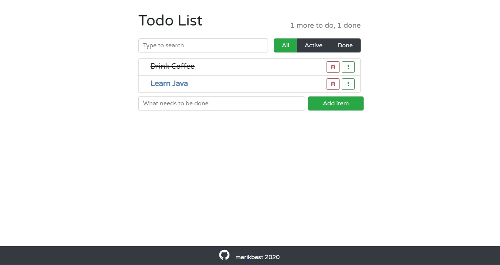

# Todo app

A simple Todo app
#### An actual version of build is deployed on AWS:
http://todolists.tk

## Used Technologies:

* Back-end: Spring (Boot, Data), JPA / Hibernate, PostgreSQL
* Front-end: TypeScript, React.js, Bootstrap
* AWS: EC2, S3, PostgreSQL RDS
* Server Build: Maven
* Client Build: npm, yarn, webpack

## Features

* Organize tasks & notes to board
* Search & filter items

### Todo List
